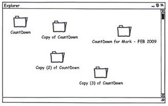
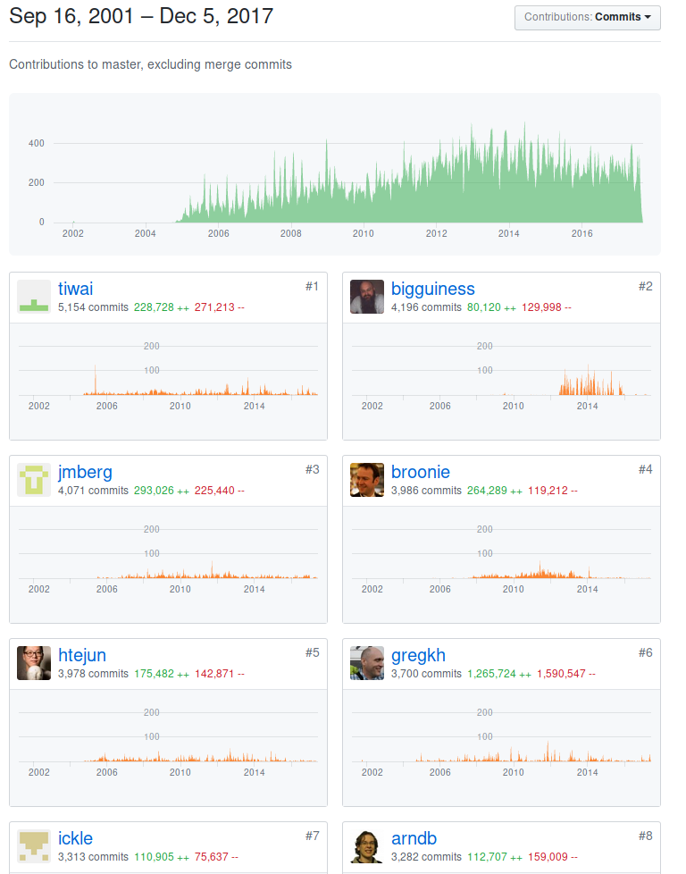
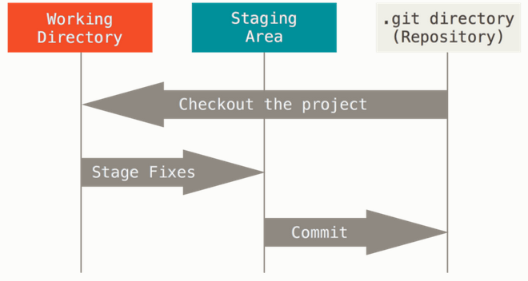
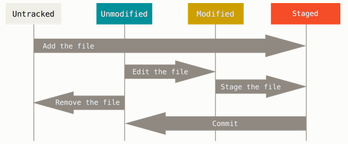

# Why

## Organisation

## Team work

# Git basics

## Working Tree, Staging Area and Git Directory

## Basic commands

~~~
git status
git add
git diff
git commit
git log
~~~

## Basic commands

## Remote Server

~~~
git clone
git pull
git fetch
git push
~~~

## Github vs Git

~~~
git remote add origin https://github.com/try-git/try_git.git
git push origin master
git pull origin master
~~~

