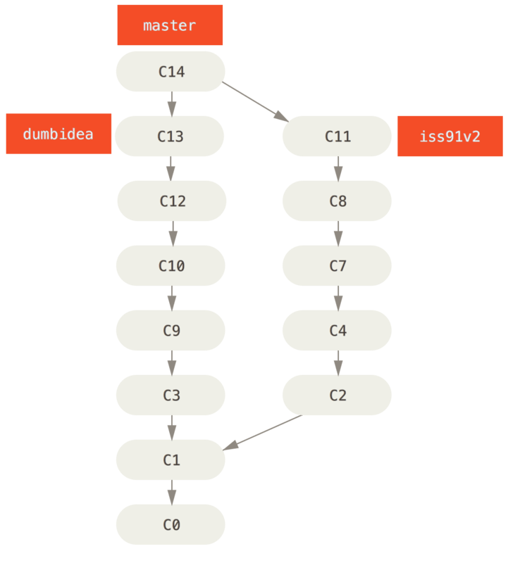

# Why

## Organisation

## Organisation (closer example)

## Team work

# Tools

## Git is not Github!

- **Git** = tool
- Github = **a** cloud service
- Alternatives:
  - Gitlab (better, less popular)
  - Bitbucket

## Tools

- Command line (default)
- Git Gui (default)
- Editor integration (matlab, atom, visual studio code)
- Gui clients:
   - Github desktop
   - Gitg
   - TortoiseGit

# Git basics

## Hidden Mess

## Working Tree, Staging Area and Git Directory

## Basic commands

## Basic commands

~~~
git status
git add
git diff
git commit
git log
~~~

## File Status

## Remote Server

~~~
git clone
git pull
git push
~~~

## Github + Git

~~~
git remote add origin https://github.com/try-git/try_git.git
git push origin master
git pull origin master
~~~

## Advanced operations

- merging
- branching
- forks/pull requests

# Workflows

## Branching worflows - Long-running branches

{width=45%} {width=45%}

## Branching worflows - Topic Branches

{width=45%}
{width=45%}

## Github Workflows

- Fork
- Pull Requests
- Testing/Deploy
- Code Review
<!-- ## Forks and Pull Requests -->
